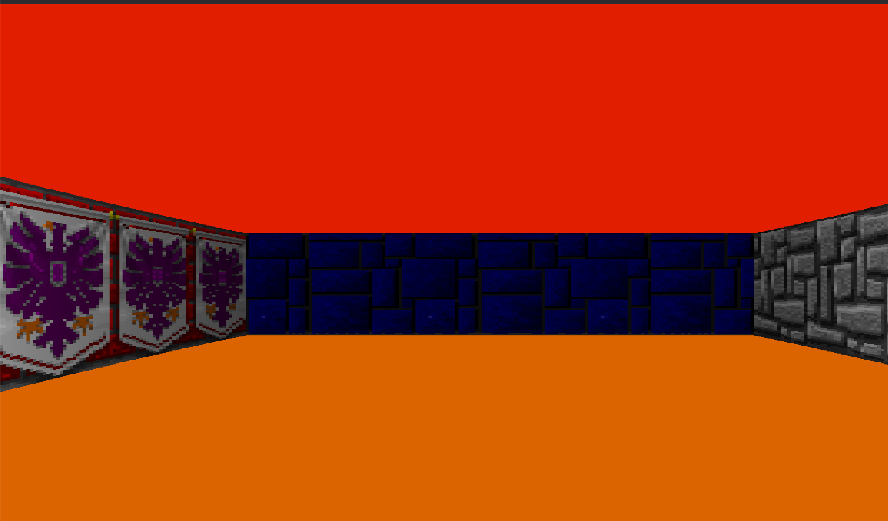
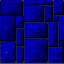

# cub3D

> A ray-casting engine that parses a custom `.cub` scene descriptor and renders a real-time, textured first-person 3D projection of a 2D ASCII grid map.



*Live render of [maps/good/map.cub](maps/good/map.cub) — orange floor / red ceiling from the scene's `F`/`C` colors, `eagle` and `bluestone` wall textures, window title tracking the facing direction (`NORTH`).*

---

## 📌 Problem Overview & Classification

- **Domain / Problem Category:** Low-Level Systems Programming / Real-Time Computer Graphics
- **Theoretical Problem:** Ray Casting (2D-grid-to-3D pseudo-projection, Wolfenstein-3D-style) combined with Flood Fill (grid connectivity / graph traversal) for map validation
- **Core Objective:** Parse a hand-written `.cub` file (wall textures, floor/ceiling RGB colors, ASCII map) into an in-memory scene description, verify the map is a fully enclosed, single-player grid, then cast one ray per screen column per frame to project textured, distance-shaded walls in real time.
- **Key Constraints & Challenges:**
  - Strict, single-pass streaming parse of the `.cub` file via `get_next_line` with an explicit error message and full cleanup on every malformed line.
  - Map-enclosure verification without a bounded/iterative visited-set: recursive `flood_fill` walks every reachable floor tile and fails if it ever reaches an out-of-bounds cell or a "hole" (space/tab) character.
  - Single-player-tile invariant (`is_multiple_player`) and duplicate-resource detection (`check_dup_data`) for textures/colors.
  - RGB channel bounds checking (`0`–`255`) and `-1` sentinel values to distinguish "unset" floor/ceiling colors from valid `0` component values.
  - Deterministic teardown on every exit path (malloc-failure rollback in `alloc_structs`, `free_gnl`/`free_lst`/`freetab` on parse errors, `free_structs` on normal and `ESC`-triggered shutdown).

---

## ⚙️ Architecture & Implementation Details

- **Modular Design:**
  - [srcs/main.c](srcs/main.c) — entry point; allocates and zero-initializes the central `t_cub` context, drives `start_parsing` → `check_map` → `launch_raycasting`, and guarantees `free_structs` on every failure branch.
  - [srcs/parsing/](srcs/parsing/) — `verif.c` (file extension + `open()` check, player-direction resolution), `get_data.c` (line-by-line extraction of `N`/`S`/`W`/`E` texture paths and `F`/`C` RGB triplets into `t_textcol`), `map.c` (streams remaining lines into a `t_list` and materializes it into `cub->map`, a `char **`), `flood_fill.c` (recursive enclosure check), `player_utils.c` (character whitelist and unique-spawn detection).
  - [srcs/utils/](srcs/utils/) — `utils_parsing.c` (`convert_int` RGB-string-to-packed-`int32_t` conversion via `ft_split`, `verif_syntax` identifier-token validation), `utils.c` (`freetab`, `free_lst`, `lstlen`, `is_number`, trailing-content check after the map), `free.c` (single `free_structs` teardown routine).
  - [srcs/raycasting/](srcs/raycasting/) — `init_raycasting.c` (MLX42 window/image bootstrap, main loop callback, FPS/CPU/RAM sampling and HUD refresh), `draw_wall.c` (per-ray column rendering), `input.c` (WASD movement/strafing with tile-collision checks, arrow-key rotation, `ESC` shutdown), `utils.c` (Euclidean distance, window-title-by-facing, PNG texture loading), `sys_stats_mac.c` / `sys_stats_linux.c` (platform-specific resident-memory sampling, selected by the `Makefile` at build time).
  - [srcs/bonus_mouse_rotate.c](srcs/bonus_mouse_rotate.c) — bonus mouse-look: toggled by `SPACE`, re-centers the cursor every frame and converts horizontal delta into a yaw increment.
- **Core Data Structures** ([include/cub.h](include/cub.h)):
  - `t_cub` — central context: file descriptor, player position/direction (`x_p`, `y_p`, `dir_p`), the parsed map (`char **map`), and pointers to `t_textcol`, `t_dr`, `t_fps_stats`, `t_hud`, plus the `mlx_t *`/`mlx_image_t *` handles.
  - `t_textcol` — raw texture path strings and their loaded `mlx_texture_t *`, plus floor/ceiling colors pre-packed as `0xRRGGBBAA` `int32_t` values.
  - `t_dr` — scratch state for the ray currently being cast (position, direction vector, distance, and the wall's vertical screen extent).
  - `t_fps_stats` — a `realloc`-doubled dynamic array of per-frame deltas (`frame_times`) used both for the live FPS/CPU/RAM HUD and the end-of-run statistical summary.
- **Key Primitives & Mechanisms:**
  - `get_next_line`: streaming line reader (from the `turbo_libft` submodule) used throughout parsing so the `.cub` file is never loaded into memory as a whole.
  - `flood_fill` ([srcs/parsing/flood_fill.c](srcs/parsing/flood_fill.c)): 4-directional recursive traversal starting at the player tile; marks visited floor as `'x'` and fails closed the instant it steps off the grid or onto whitespace, proving the map is fully walled without a separate visited-matrix allocation.
  - `mlx_loop_hook` / `mlx_key_hook` (MLX42): registers `draw()` as the per-frame render callback and `key_press_hook` as the discrete key-event callback, versus `mlx_is_key_down` polling used for continuous movement.
  - Fixed-step ray marching ([srcs/raycasting/draw_wall.c](srcs/raycasting/draw_wall.c) `launch_rays`): advances the ray position by `dir * 0.01` per iteration (capped at `get_distance_sq(cub) < 100`) instead of classic grid-line DDA, testing the map cell under the ray after each axis step to detect a N/S vs. E/W hit (`cub->we`) for texture-face selection.
  - `color_dist` / `get_text_color` / `get_pixel`: per-pixel texel lookup from the hit texture (`x_text` derived from the sub-tile hit offset, `y_text` remapped from screen-space wall height) attenuated by `distance / 2` for depth shading, then blitted with `mlx_put_pixel`.
  - `clock_gettime(CLOCK_MONOTONIC)` + `getrusage(RUSAGE_SELF)`: wall-clock frame delta and CPU-time delta sampled every frame in `fps_counter`, aggregated once per second into the HUD and a `qsort`-based 1%-low / average / max / coefficient-of-variation summary printed on exit (`print_fps_summary`).
  - `task_info(mach_task_self(), MACH_TASK_BASIC_INFO, …)` (macOS) vs. parsing `VmRSS` out of `/proc/self/status` (Linux): platform-specific resident-set-size sampling for the RAM readout, dispatched at build time via the `Makefile`'s `UNAME_S` check.
- **Lifecycle & Resource Management:**
  - `alloc_structs` allocates `t_cub` and its nested `t_textcol`/`t_dr`/`t_fps_stats`/`frame_times`/`t_hud` members individually, unwinding every prior allocation on the first `malloc` failure.
  - `init_structs` zero/sentinel-initializes all fields (`-1` for unset floor/ceiling colors, `NULL` for every pointer) before parsing begins.
  - Every parsing failure path closes and drains the file descriptor via `free_gnl` (so a partially-buffered `get_next_line` never leaks) and releases intermediate structures (`free_lst`, `freetab`) before returning an error code up to `main`.
  - `free_structs` is the single teardown entry point: deletes loaded `mlx_texture_t` handles and their path strings, frees the ray-state and FPS buffers, deletes the main and HUD `mlx_image_t` instances, calls `mlx_terminate`, then frees the map rows and the context itself. It runs on normal exit, on any parsing/raycasting failure in `main`, and on `ESC` (which also prints the FPS summary and calls `mlx_close_window` first).
  - There is no installed `sigaction`/`signal` handler for `SIGINT`/`SIGQUIT`; process shutdown is driven exclusively by the `ESC` key handler and the window-close path through MLX42.

---

## 🛠️ Stack & Tooling

| Category | Tools / Technologies |
| :--- | :--- |
| **Language / Standard** | C (compiled with default `cc` dialect; project follows 42/Codam Norm-style headers) |
| **Graphics** | [MLX42](MLX42) (GLFW-backed minimal graphics library, built as a static lib via CMake) |
| **System Primitives** | POSIX file I/O (`open`, `get_next_line`), `clock_gettime`, `getrusage`/`sys/resource.h`, `mach/mach.h` `task_info` (macOS) or `/proc/self/status` parsing (Linux), `pthread` (linked for GLFW/MLX42) |
| **Custom Libraries** | [turbo_libft](turbo_libft) (git submodule) — `ft_split`, `ft_strtrim`, `ft_atoi`, `ft_strdup`, `t_list`/`ft_lstnew`, `get_next_line` |
| **Compiler & Flags** | `cc` with `-Wall -Wextra -Werror -g3` |
| **Build System** | GNU `make` (application) + `cmake` (MLX42 static library) |
| **Diagnostic Tools** | Valgrind (`--leak-check=full`) recommended for the parsing/free paths; no ThreadSanitizer build target is defined |

---

## ⚙️ Configuration Constants

Defined in [include/cub.h](include/cub.h):

```c
# define SCALING_SIZE       24        // Minimap/grid cell scale factor
# define FOV                60        // Field of view, in degrees
# define WIDTH              1920      // Window width, in pixels
# define HEIGHT             1080      // Window height, in pixels
# define MOVE_SPEED         0.05      // Player movement speed, in map units/frame
# define MOUSE_SENSITIVITY  0.00075   // Mouse-look yaw radians per pixel of movement
# define FPS_INITIAL_CAPACITY 3600    // Initial capacity of the frame-time buffer
```

---

## 🚀 Getting Started

### Prerequisites
- Linux or macOS (build dispatches on `uname -s` for the RAM-sampling backend and macOS-specific `-I/opt/homebrew` GLFW paths).
- `cc`, `make`, `cmake`.
- `glfw` development package available on the library path (`-lglfw`), plus `libdl`/`libm`/`pthread`.
- Git submodules initialized (`MLX42`, `turbo_libft`):
  ```bash
  git submodule update --init --recursive
  ```

### Compilation
```bash
make
```
This first builds `MLX42/build/libmlx42.a` via `cmake`/`make`, then builds `turbo_libft`, then compiles and links `cub3D`.

### Usage
```bash
./cub3D [path/to/scene.cub]
```
The argument must be a single, existing, readable file whose name ends in `.cub`; `main` rejects any other argument count outright.

*Example:*
```bash
./cub3D maps/good/map.cub
```

This scene assigns one wall texture per cardinal direction via the `.cub` `NO`/`SO`/`WE`/`EA` identifiers:

| `NO` (North) | `SO` (South) | `WE` (West) | `EA` (East) |
| :---: | :---: | :---: | :---: |
|  |  |  |  |
| `bluestone.png` | `colorstone.png` | `eagle.png` | `greystone.png` |

**Controls:**
| Input | Action |
| :--- | :--- |
| `W` / `S` | Move forward / backward |
| `A` / `D` | Strafe left / right |
| `←` / `→` | Rotate view |
| `SPACE` | Toggle mouse-look (mouse-driven rotation) |
| `I` | Toggle FPS/CPU/RAM HUD |
| `ESC` | Print FPS summary to stdout and quit |

### Build Targets
- `make`: Compiles production binaries.
- `make clean`: Removes intermediate object files (`.o`).
- `make fclean`: Removes object files and compiled binaries.
- `make re`: Rebuilds the entire project from source.

---

## 🧪 Testing & Reliability Verification

### Map Fixtures
[maps/good/](maps/good/) and [maps/bad/](maps/bad/) contain curated `.cub` files exercising accepted scenes (varied player facing/position, whitespace-padded rows, alternate texture/color ordering) and rejected ones (wrong extension, missing/duplicate textures, invalid RGB, multiple/no player, unenclosed map — one hole fixture per cardinal direction, oversized map).

```bash
# Exercise the rejection path for every malformed fixture
for f in maps/bad/*; do echo "== $f =="; ./cub3D "$f"; done

# Exercise the accepted-scene rendering path
./cub3D maps/good/map.cub
```

### Memory Leak Check
```bash
valgrind --leak-check=full --show-leak-kinds=all ./cub3D maps/bad/textures_missing.cub
```
Run against a `maps/bad/*` fixture to validate the error-path cleanup (`free_gnl`, `free_lst`, `freetab`, allocation rollback in `alloc_structs`) without needing a display/MLX42 context.

- [x] Rollback-safe allocation: any `malloc` failure in `alloc_structs` frees every previously allocated field before returning `NULL`.
- [x] Every parsing error path drains and closes the map file descriptor (`free_gnl`) before propagating the error.
- [x] Map-enclosure and single-player invariants enforced before any rendering resource is touched (`check_map` runs before `launch_raycasting`).
- [x] Full graphics teardown on exit: textures, HUD images, main framebuffer image, and the MLX42 context are all released in `free_structs` before the process exits.

---

## 👥 Contributors

- **hclaude** — [@h-claude](https://github.com/h-claude)
- **aurban** — [@aurban](https://github.com/Anantiz)

---

## 📚 Resources

- [Lode's Raycasting Tutorial](https://lodev.org/cgtutor/raycasting.html)
- [MLX42 Documentation](https://github.com/codam-coding-college/MLX42)
